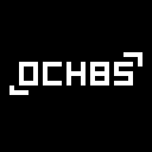

<div align="center">

<h1>och8S</h1>
A CHIP-8 emulator made on C23 and SDL2.
</div>

## Prerequisites
- `gcc` compiler version 14 or later (`clang` can be used but the Meson setup can't be done with `just`).
- The [Meson build system](https://mesonbuild.com/).
- The [Just command runner](https://just.systems/man/en/).

If you are using the [Nix package manager](https://nixos.org/) you may be interested in the provided [`flake.nix`](./flake.nix) file.

## Usage
First setup the project:
```sh
just setup
```

Then just compile and run it pointing to your ROM file:
```sh
just run <rom-path>
```

The following executions can just be made by pointing to the previously compiled file:
```sh
build/src/och8S <rom-path>
```

### Controls
The CHIP-8's keypad is mapped like this:
```
123C  ->  1234 
456D  ->  QWER
789E  ->  ASDF
A0BF  ->  ZXCV
```

The emulator has basic savestate capabilities:
- Save to the savefile: `N`.
- Load from the savefile: `M`.

> [!WARNING]
> For Windows users:
> och8S uses the POSIX only `getopt()` function from the header `unistd.h` so the usage of [MinGW](https://www.mingw-w64.org/) or [Cygwin](https://cygwin.com/) is obligatory to be able to compile the Windows NT platform.

## Acknowledgements
- Created with :heart: by [Jorge "Kutu" Dobón Blanco](https://dobon.dev).
